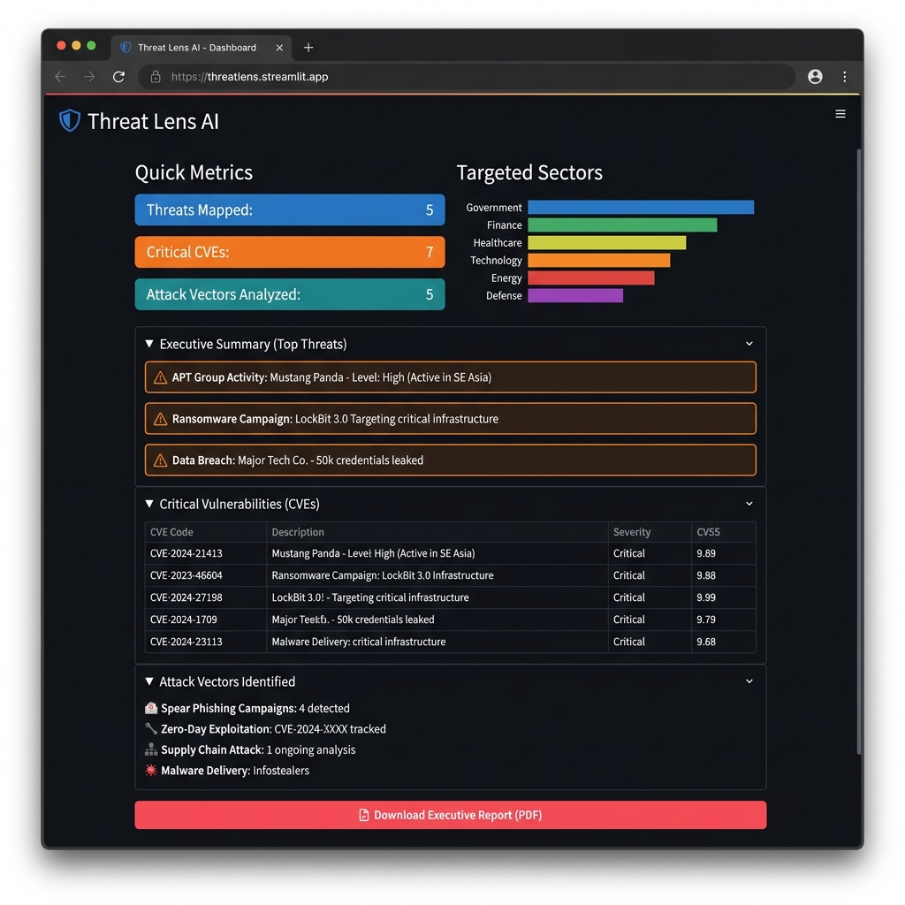
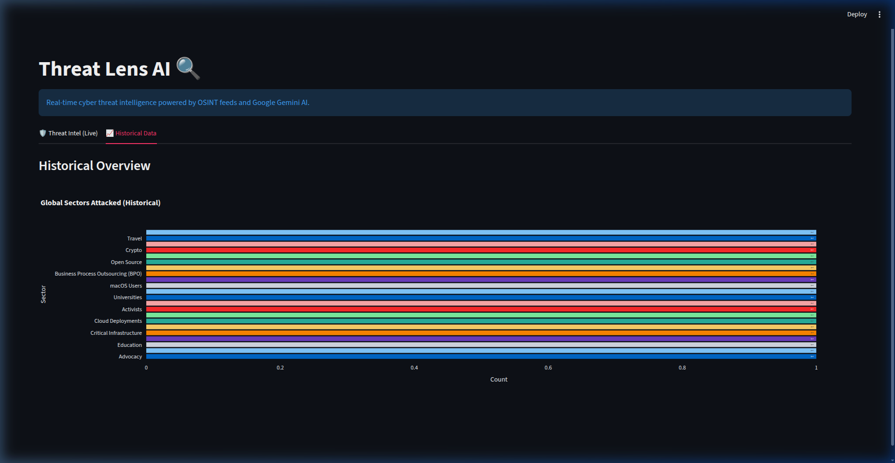
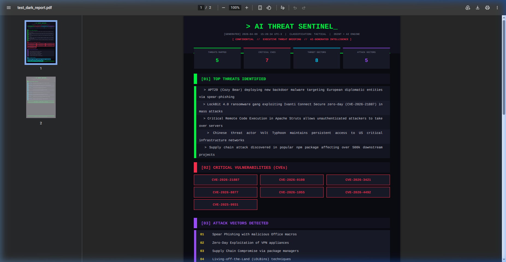
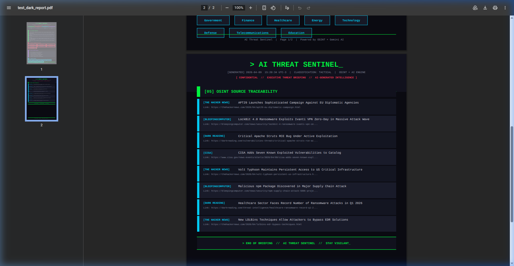
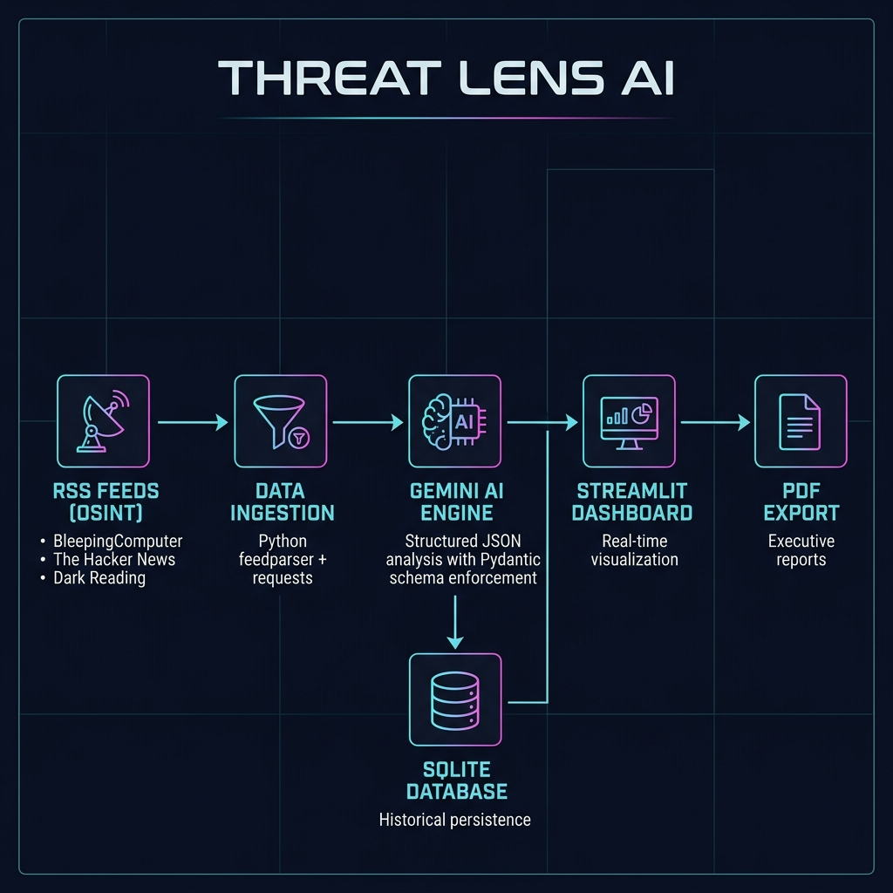

# Threat Lens AI 🔍

**Threat Lens AI** is a real-time cybersecurity intelligence platform that aggregates Open-Source Intelligence (OSINT) from leading threat feeds and processes it through Google Gemini AI to deliver structured, actionable tactical reports.

Built with **RAG-inspired (Retrieval-Augmented Generation)** principles to eliminate AI hallucinations in Security Operations — the system first intercepts real-time RSS feeds from top cybersecurity outlets, then feeds that verified context to the AI model for structured analysis using strict Pydantic schemas.

---

## 📸 Screenshots

### Live Threat Intelligence Dashboard
> Tactical report with quick metrics, targeted sectors, executive summary, CVE tracking, and attack vector analysis.

<p align="center">
  
</p>

### Historical Trend Analysis
> Cross-day tracking of globally targeted sectors, powered by automated SQLite persistence.

<p align="center">
  
</p>

### Executive PDF Report (Dark-Themed)
> Terminal-styled, tactical SecOps brief with full OSINT source traceability — designed for C-level and SOC team consumption.

<p align="center">
  
  &nbsp;
  
</p>

---

## 🏗️ Architecture

<p align="center">
  
</p>

```
RSS Feeds (OSINT) → Data Ingestion → Gemini AI (Structured JSON) → Dashboard + PDF Export
```

**Intelligence Sources:**
- BleepingComputer
- The Hacker News
- Dark Reading

---

## ✨ Features

- **Automated OSINT Collection** — Scrapes multiple threat intelligence feeds concurrently with timeout control and error handling
- **RAG-Grounded Analysis** — AI responses are strictly grounded in ingested news context, ensuring zero hallucinations
- **Structured Output** — Pydantic schemas enforce strict JSON output from the LLM, preventing prompt injection
- **Interactive Dashboard** — Streamlit-based dark-mode UI with real-time metrics, charts, and full source traceability
- **Historical Tracking** — SQLite persistence for cross-day trend analysis of targeted sectors
- **Executive PDF Export** — Dark-themed, terminal-styled PDF reports with metrics dashboard, CVE grid, and OSINT source feed

---

## 🛠️ Tech Stack

| Component | Technology |
|---|---|
| Frontend | Streamlit |
| AI Engine | Google Gemini 2.5 Flash (`google-genai`) |
| Data Schema | Pydantic (structured JSON output) |
| OSINT Ingestion | `feedparser`, `requests` |
| Persistence | SQLite3 |
| PDF Generation | fpdf2 |
| Visualization | Plotly, Pandas |

---

## 🚀 Getting Started

### 1. Clone the repository
```bash
git clone https://github.com/yourusername/threatlens-ai.git
cd threatlens-ai
```

### 2. Set up the environment
```bash
python3 -m venv venv
source venv/bin/activate
pip install -r requirements.txt
```

### 3. Configure API key
```bash
cp .env.example .env
```
Edit `.env` and add your Gemini API key:
```
GEMINI_API_KEY=your_actual_api_key_here
```
> Get a free API key at [Google AI Studio](https://aistudio.google.com/app/apikey)

### 4. Run
```bash
streamlit run app.py
```
The dashboard will be available at `http://localhost:8501`.

---

## 📁 Project Structure

```
threatlens-ai/
├── app.py              # Streamlit dashboard (main entry point)
├── ai_analyzer.py      # Gemini AI engine with Pydantic schema enforcement
├── fetch_news.py       # OSINT RSS feed collector
├── db_manager.py       # SQLite persistence layer
├── pdf_exporter.py     # Dark-themed executive PDF generator
├── requirements.txt    # Python dependencies
├── .env.example        # Environment variable template
├── assets/             # README images and screenshots
└── .streamlit/
    └── config.toml     # Streamlit theme configuration
```

---

*Built as a modern AI-driven approach to Security Operations.*
